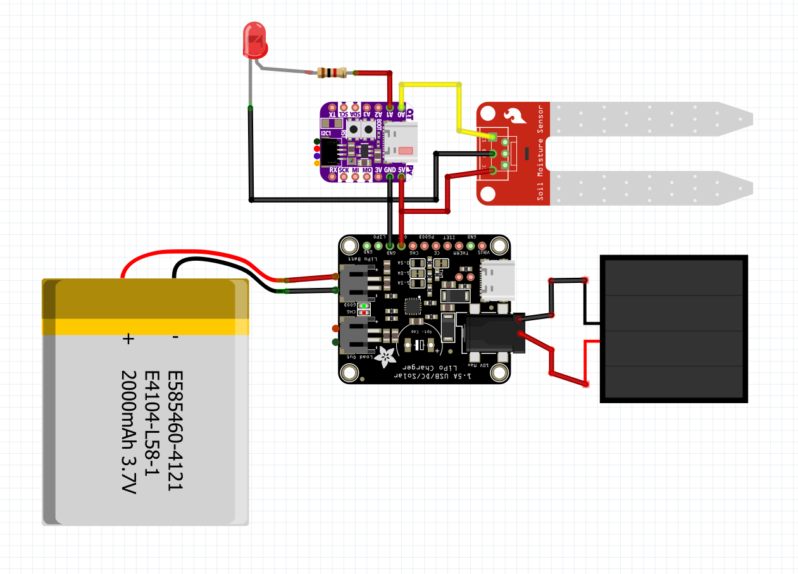

# Soil_Moisture_Sensor
Attempting to stop a plant dying, time that could have been spent watering has been spent doing this

## Parts list:
- [Adafruit QTPy ESP32-S2](https://thepihut.com/products/adafruit-qt-py-esp32-s2-wifi-dev-board-with-stemma-qt?variant=41473929773251)
- [Adafruit Lipo charger](https://www.adafruit.com/product/4755)
- [2000mAh Lipo battery](https://thepihut.com/products/2000mah-3-7v-lipo-battery?variant=42143258050755)
- [Soil moisture sensor](https://thepihut.com/products/capacitive-soil-moisture-sensor?variant=32137736421438)
- [6V solar panel](https://thepihut.com/products/6v-2w-solar-panel-etfe-voltaic-p126?variant=41523215859907)
- [DC jack adapter](https://thepihut.com/products/3-8-1-3mm-or-3-5-1-1mm-to-5-5-2-1mm-dc-jack-adapter-cable?variant=27740115985)

## Circuit diagram

